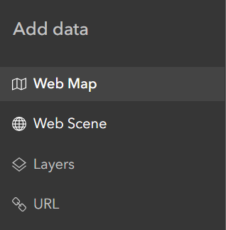
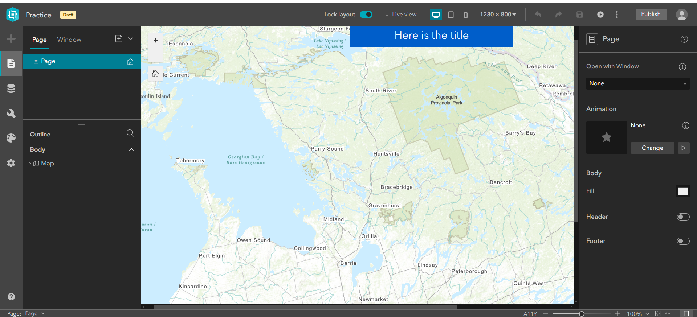
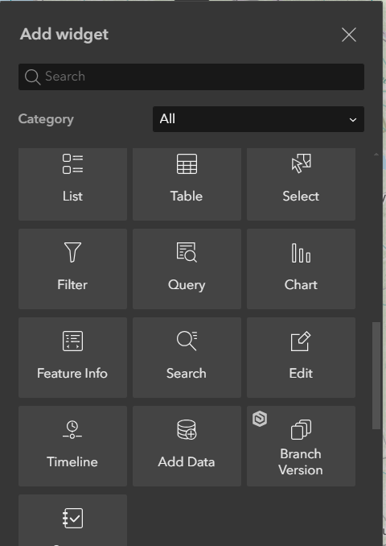
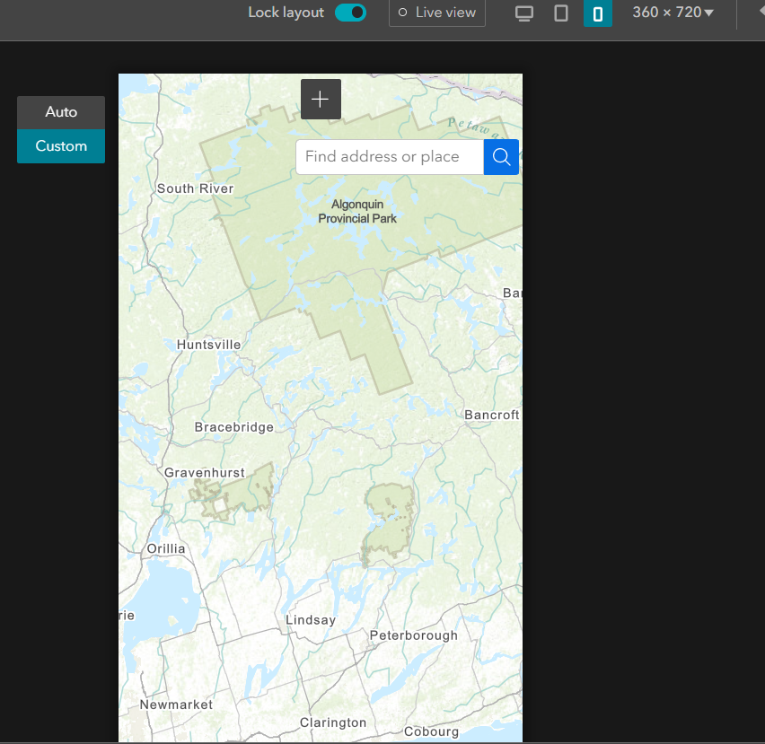
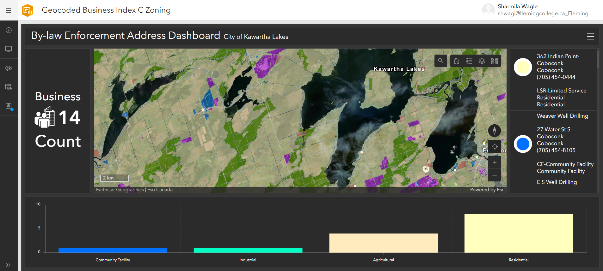

### Start time 23.30 
### End Time 

# ArcGIS Experience Builder 

https://www.esri.com/en-us/arcgis/products/arcgis-experience-builder/overview 

It is Esri solution for building web app without having to code. 

 

It Consists of simple steps 

Easy configure (Simply drag and drop widgets with no coding required) 

https://www.youtube.com/watch?v=6e7Q6sN-kcs 

 

It can incorporate various 2D web maps, 3D Scenes, Layers and URL 

Pages can be added with simple add page tool and menu and other various items can be similarly added.  

Using add widget any component can be added  

Then it can also be customized for the mobile view.

Different stories about ArcGIS Experience Builder 
https://www.esri.com/en-us/lg/industry/education/stories/university-of-maryland-students-develop-interactive-site-with-web-app-tool 
https://www.esri.com/en-us/lg/product/stories/somerset-county-case-study

### Review 
This can be no code solution for web. 
The item like web map and dashboard can be just dragged and dropped while only using UI/UX.  
Can be designed for desktop, tablet and mobile phones at the same platform.  

### Budget
Experience Builder is included with the Creator and GIS Professional user types 

It will always remain in the arcgis domain and cannot be customized into other domain. 
(For our collab clients want it in their domain, but it cannot be customized)
It also cannot be moved from one account to another. ( If we create it using our student account it cannot be directly transferred to the clients account)  

# Dashboard 

https://www.esri.com/en-us/arcgis/products/arcgis-dashboards/overview 
It is most commonly used to represent data in interactive ways.
Various components like map, graphs, charts, address count and location information can be shown using the dashboard. 
The data can be used form the AGOL and the updates will be reflected in the dashboard. 
### Resources 
https://www.esri.com/en-us/lg/product/cdot-case-study 
### Budget 
Dashboard is included with AGOL account 

This is also no coding UI/UX solution. 

# ArcGIS HUB 

https://www.esri.ca/en-ca/products/geo-enabled-products/arcgis-hub 

 

ArcGIS hub is another no code web page designer. 

It also organizes the data and tools using UI/UX.  

Some of its features are
Share open data
Organize around initiatives
Create unlimited websites and web pages 
Inspire action 
Community engagement 
Example is https://geohub.brampton.ca/ 

### Budget
https://www.esri.com/en-us/arcgis/products/arcgis-hub/pricing 
Included with ArcGIS Online subscription  (Basic) 
Additional annual fee for Premium 

 
