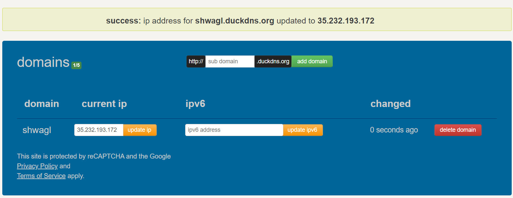
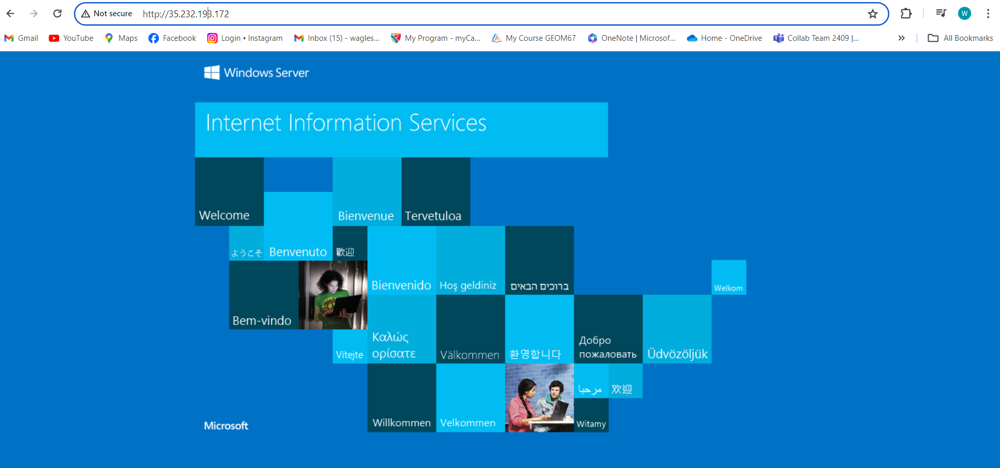
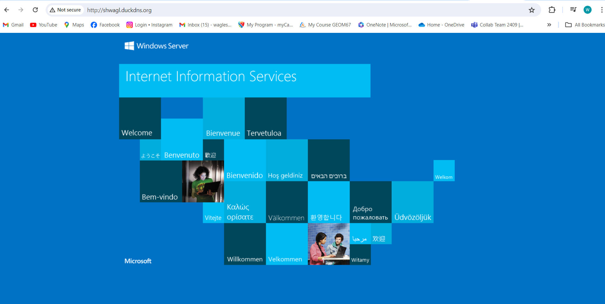
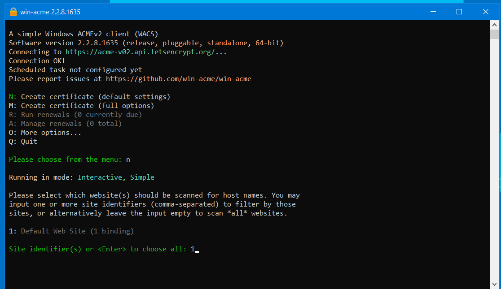
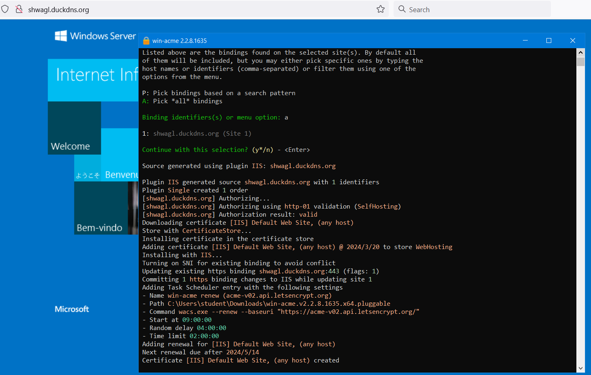
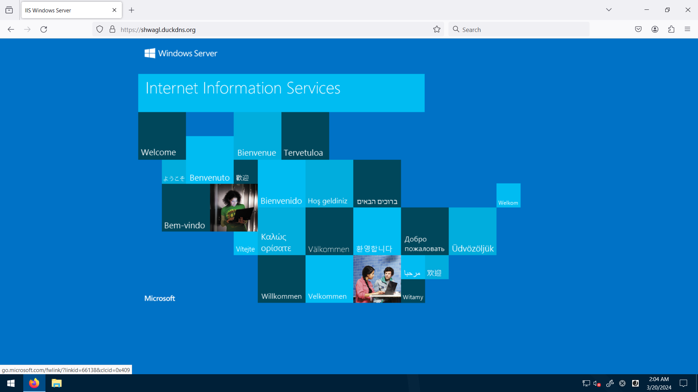

Date March 16, 2024 

Start time 21:40 

Stop time 22:00 

Total time 20min 

 

Go to Duckdns 

Login with email address 

Go to subdomain and choose your domain name 
Here shwagl and the url will be https://shwagl.duckdns.org 

When the active VM IP is used this page will open up 

The same page will open up when using subdomain.duckdns.org 

 

With the VM active go to the VM ( remote desktop connection) 
Open the browser in the VM and search for win-acme 
Download and extract it. 
Search for iis>arcgisserver>site>binding>edit 
Change to https>port 443 
Add the host name  
Shwagl.duckdns.org 
Add the license(can be selected any) and add 
Then run win-acme.exe as aadministrator 
The following window will open up 
Enter n (create certificate) 
Enter 1 ( default web site)
Enter a (Pick all bindings)
And add email address as contact information 
The certificate will be created 

After the certificate is created open shwagl.duckdns.org and the same window as before will open up.
This certificate needs to be created after some months until then only the ip address in the duckdns needs to be updated and the duckdns domain can be used for the remote desktop (VM)

