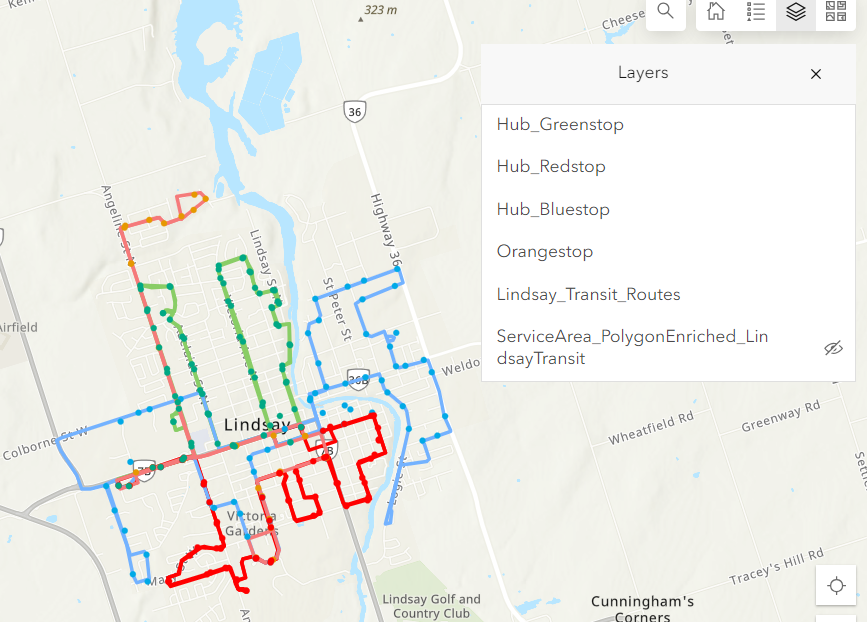
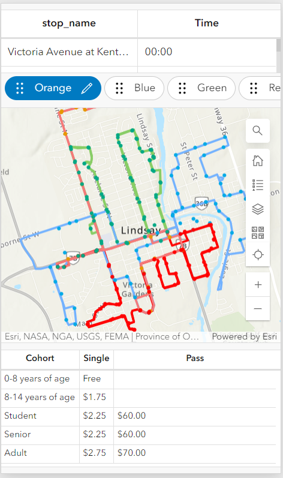
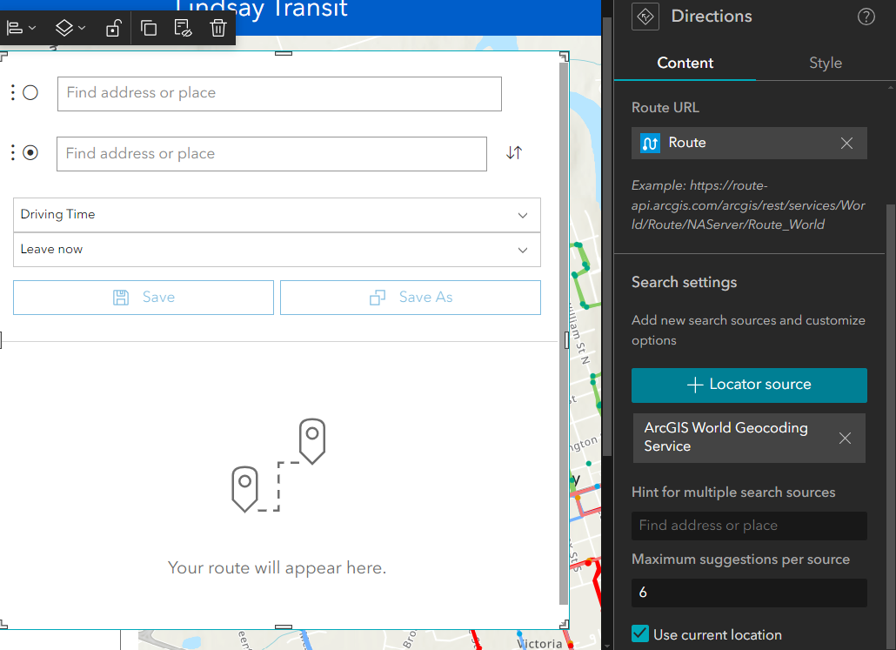
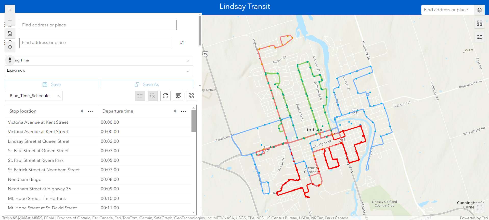

### Date: 2024, March 23
### Time Started: 11:30
### Time Ended: 3:00
Data Acquisition and Processing 

For the Lindsay Transit 

From Lindsay Transit website created the csv file for the schedules of each route since the data was not available elsewhere 
Added the data into the ArcGIS pro and joined to the feature class with routes and stops
The name of the stops in the available feature layer was different form the bus stops from the Lindsay Transit website 
Repeated the join for another data set which is available in the hub but is not current 2020.
Most of the bus stops name are matched except for the updated ones since 2020.  
This data set also does not have Orange Route at all.
For the Orange stops name were matched with the updated dataset 
Exported orange route from this data set. 
Added the csv file for the schedule of each route as well as the bus stop feature into AGOL
While adding the CSV file the option of both csv and Table (hosted) were selected so that the table can be used in other Esri suites as well. 

# Dashboard 
For the general UI/UX idea first dashboard was created
The maps with all the routes, and stops layer was created in AGOL
In the create dashboard Lindsay Transit dashboard was created 
Then the following map was added to the dashboard 

Then the tables for the schedule of each route was added with function to navigate to routes using different tab.
Also the Fare table was added to the dashboard. 
Then the legend was also included( Even though with the appropriate color the map is self-explanatory ) 
## For Phone View 

Since Transit information are generally accessed remotely, the phone view was also designed for this dashboard.
In the limited space the schedule for the route, map and the fare table are added. 

# Experience Builder 
To build the custom application for the Lindsay Transit experience Builder since it has many more widgets
In experience Builder Lindsay Transit was created
Using add data, the route and bus stop map was added 
Then using same add data the schedule and fare table were also added. 
The tables for schedule are docket together so that user can navigate through each table at a time.
Also using the Direction widget I have tried to use the routing for our data sets. 
But this uses the ArcGIS Geocoding Services 

This routing is similar to the Google map routing
But I am not able to use the custom data form the table for routing. 
I am also trying to add the trigger so that only the time after the current time is shown but I have not been able to. 

# Esri Hub 
Another common platform where transit maps are published are Hub 
But we are not able to create hub.  
IF we were to create hub, It would contain all the route maps, Bus stop information, time schedule and Fare information. 
One good example for this is Brampton GeoHub
https://www1.brampton.ca/EN/residents/transit 
It consists all the information mentioned above and many more. 
