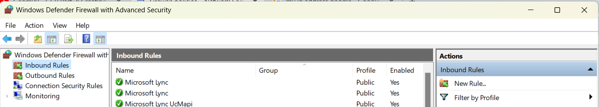
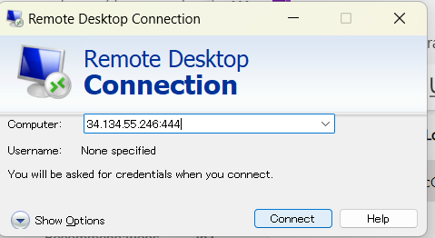

# Setting Up ArcGIS Server On GCP
### Wednesday , March 06, 2024 
### tart time 20:15pm 
### Stop time 21:45pm 
### Total Time 1:30  

 

Google credit was claimed and email address was provide to Instructor so that there was sufficient credit to start this process. 
  Log into the google account which has been granted access by Shawn. 
  To confirm if you have access check for Shawn's ArcGIS Server( If you do not see this you do not have access) 
Go to Google Cloud >Console> Project list>New Project 
Create My First Project( If it does not already exist during credit application)  
Since this is individual project location can be left as default ( No organization) 

Run a GCP Virtual Machine to test ArcGIS Server 
With your project (My First Project Geom99) Selected  
Compute Engine >VM instances> Create Instances 

Name VM ( needs to be arcgisserver-geom99 for academic purpose) but generally can be anything. 
Leave the region and zone as default which means the VM on a server in Iowa USA is being created. 
For Machine Configuration we will leave as default ( E2 which has 2vCPU and 4GB memory) which will be enough for our case. 

*** Depending on which Machine you select you will be charged so make sure you pay attention while choosing this.*** 
***In a business or production environment use Esri’s requirements (8gb RAM)*** 

We can choose different images to start (Mostly Linux based are free but we are using Microsoft Windows Server which is not free. 
We are using image provided by Shawn ( Stored in his account)  
Boot Disk> Change>CUSTOMIMAGES> Change> ALL> Select Shawn's ArcGIS Server(** Need to have been granted access) 

Once the server is selected, go the dropdown list in custom images> Select the only image present( latest if multiple exist). 

## Enabling Firewall for HTTP and HTTPS which allows web server pre-installed to work. 

# Firewall 

Check both Allow HTTP traffic and Allow HTTPS traffic. 
Then CREATE ( Will take some time) 
Once created the status will have green tick mark indicating active status. 

Currently its inactive/ Stopped 

#### To create password ( which you will need to access this VM) 

Dropdown list beside RDP>Set Windows Password 
Set new password Username >student(Academic requirement) can be anything otherwise. 
** New windows password for this account will be shown.** 
Here the password is changes and saved on this VM and will only be shown one. Be sure to write down as you will need this to be able to use this VM** 
If forget password or misplaced can be regenerated again by repeating this exact steps*** 

 ## Setting UP Firewall rules 

Setting up firewall rules to make it work from Fleming computers. The default for RDP is TCP port 3389 which is blocked by Fleming IT for security reasons. The VM images in instructors server id specifically configured to listen to 444 for remote desktop instead of 3389. We need to have TCP 444 open on the firewall to allow RDP into the machine.   

Setup firewall rules> CREATE FIREWALL RULE 
Set name to be flemingrdp444 ( for constancy in this course) can be anything 
Targets>All instances in the network 
Source filter> IPv4 ranges 
Soruce IPv4 ranges 
Search for my ip address in google and add here 
( use 0.0.0.0/0  which means any computer if you do not want to restrict use)  
***This is not suggested for the security reasons*** 

142.237.0.0/16  For Fleming Campus Computer 
*Changes can be made while working from different places I.e. college and home** 
Protocols and Ports>> select TCP and type 444 ( for this case) Normally it is 3389. 
CREATE 

## Setting a GCP Firewall Rule to allow ArcGIS Server Management Ports 

ArcGIS server management has two ports 6443 and 6080 which are not open by default by GCP firewall rules. So we need to permit these ports from outside of the VM. 
VPC network> Firewall> Create Firewall Rule 
Firewall rule name> arcgisserveradmin 
Targets> All instances in the network 
Source filter >IPv4 ranges 
Source IPv4 ranges>  Your IP address or 0.0.0.0/0 for any computer(not recommended) 
Protocols and Ports> Specified protocols and ports> TCP >Type in > 6443, 6080 
SAVE 

## Setting a windows Firewall Rule to allow ArcGIS Server Management Ports 

There will be another firewall for the windows for the device itself which needs to allow TCP 6443 and 6080 to pass through outside the network. This is permanent setting in windows that needs to be done once per virtual machine.  
*** to be set in the VM or remote desktop not on local computer*** 
Log into remote desktop on the started windows server make sure the status of the VM is active.  
Type Windows Defender in the start menu and select Windows Defender Firewall with Advanced Security option. 
Click on the Inbound Rules >New Rule> Port> NEXT 
Select TCP and Type 6443,6080 (6443 for ArcGIS Server administrator and optionally 6080)> Next 
Allow the connection 
The rule will apply for all options, Domain, Private and Public> Next 
Name this rule to be ArcGIS Server Admin Ports ( to be consistent) >Finish 
This firewall rule will go live immediately and persist after restart of the server, so does not need to be set again.  

 

***The configuration here makes the Google Firewall (configured in Step 1) more restrictive (ideally open only to access on one IP address) and the Windows firewall permit any connection to these ports since the GCP rule is first in the line of firewalls.*** 

 

## Starting an existing/ Shutdown VM on GCP 

***While not in use make sure to shut down VM to reduce the cost*** 

To start using the VM 
Open the GCP> Compute Engine> VM instances 
Under the list check the status (green tick is active) 

Click on the three dots on the right most corner of the VM list then select Start/ Resumue or Stop accordingly. 

Each time the VM starts running it will have different External IP (which will be required to connect to the ArcGIS Services and remote desktop)  
***This can also be static or same but will be more expensive*** 

## Remote Desktop to VM Desktop 

Once the VM is running / active  on the start menu of local device type> Remote Desktop Connection (mstsc for the short name) 
Following window will open up. 
Use the external IP of the active VM 
IP:443>Connect  
new password for VM 
External IP 

34.134.55.246 in this instance 

 

### For the remote Desktop connection the IP address changes everytime the VM is started 

Windows Security window will open up. 

For credential type user name as> student 
Use the password previously recorded here (*The password remains the same even the VM has been started again)

Select yes  
Now the Remote Desktop will open up. 

 

 

# Turning off this Remote Desktop/ VM 

While not in use always turn off the VM to save money.  
Once its stopped the External IP will be released/ given to other users and all the services will stop working. 
$${\color{red}Turning Off using Windows Desktop Console 
Make sure that the only way to turn off the Remote Desktop is  
Start menu> Shut Down }$$
Pressing X or closing the Remote Desktop Window does  not shut down the machine. 
It is similar to turning off the monitor screen while the CPU is still turned on. As soon as you turn on the monitor you will have everything you had active. 
Signing out also does not shut the machine down.  

 

## Turning the VM form the GCP 

The other way to turn off the VM is GCP 
GCP>Compute Engine> VM Instance> locate the VM > triple dot> STOP 
To confirm check the status 

## Open ArcGIS Server REST Service directory with self-signed certificate 
With the active server browser can be used on the computer to connect to the ArcGIS Server REST endpoint to see and open the manager to control those services. This will also need the  current External IP of the VM .  
On the browser type in  
https://CurrentExternalIP/arcgis/rest/services 
***in currentExternalIP make sure to use current External IP of the active VM form GCP. 
This will prompt to the following window. Select advance and select unsafe 

IF the following rest services tab opens then the VM has been set up properly 

 

