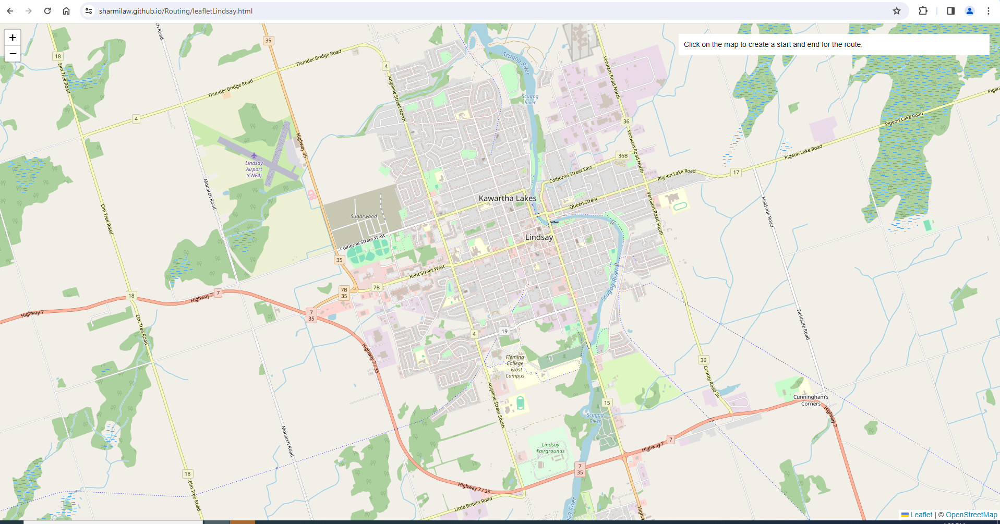

### Start Date April 5 2024
## Start Time 23:50 
### Stop Time 00:30 

#  Esri Leaflet
the reference was taken from 
https://developers.arcgis.com/esri-leaflet/layers/add-a-feature-layer/#:~:text=Use%20the%20FeatureLayer%20class%20to,and%20set%20the%20url%20property.

https://github.com/esri/esri-leaflet

The demo was created without making any changes
The following errors was found

For Lindsay Transit, following changes were made
Since the basemap was not loading the base map was changed
The feature layers from the Esri Content were added
Still there are some errors but this is the final product.

https://sharmilaw.github.io/Routing/leafletLindsay

Still I am not able to add the feature layers 
(might try with the geojson file) 
And the routing is also not working 
