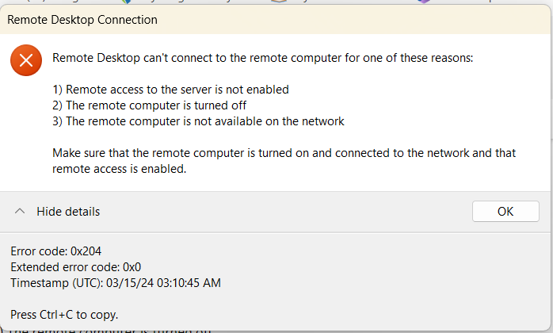
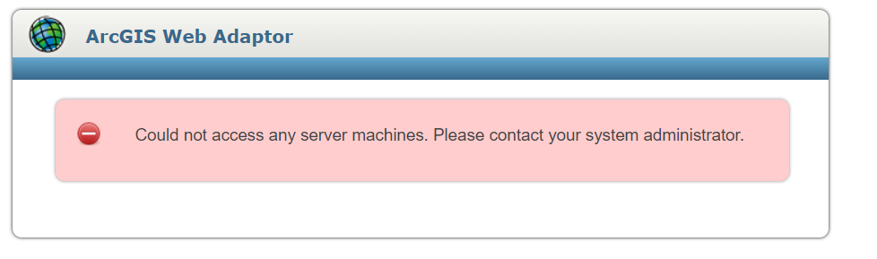
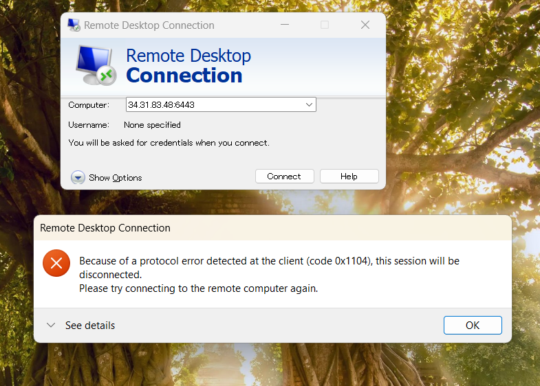
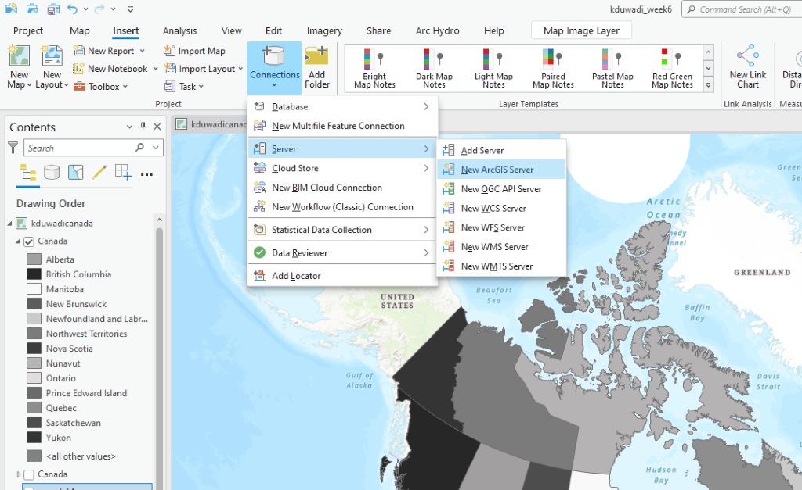
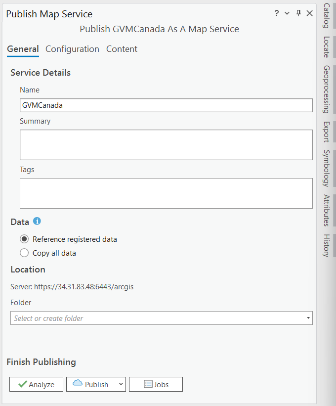
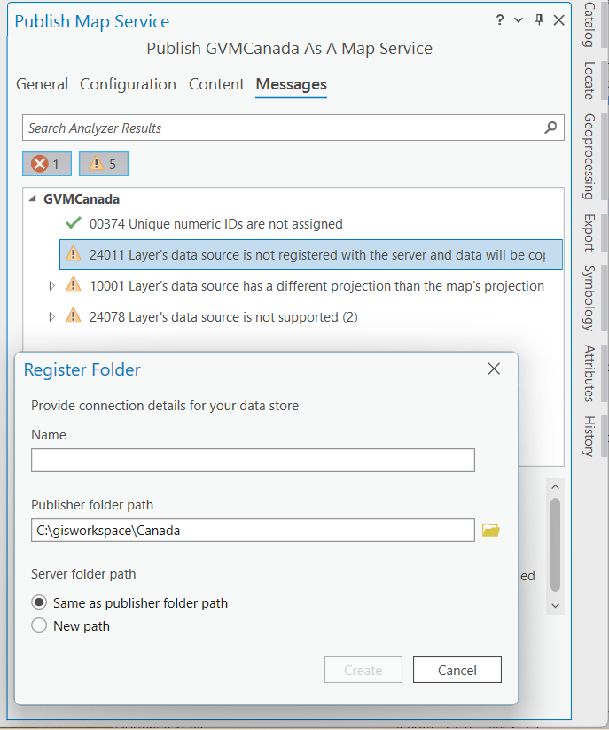
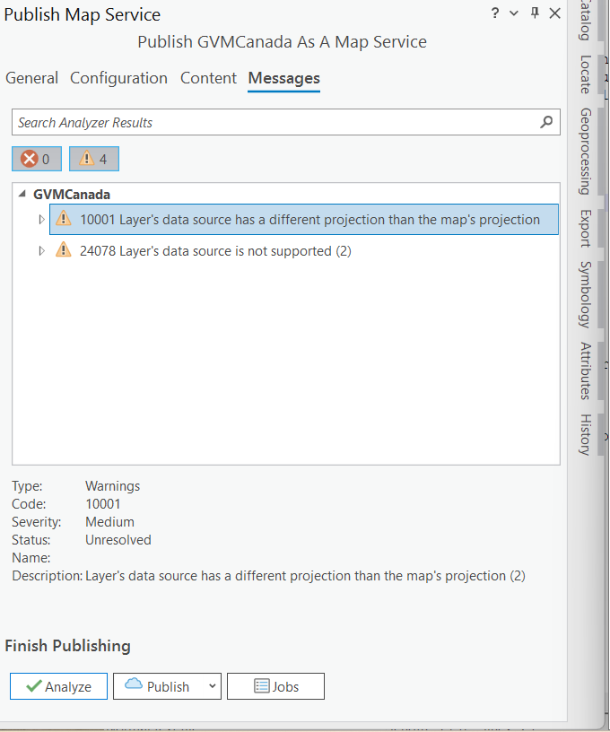
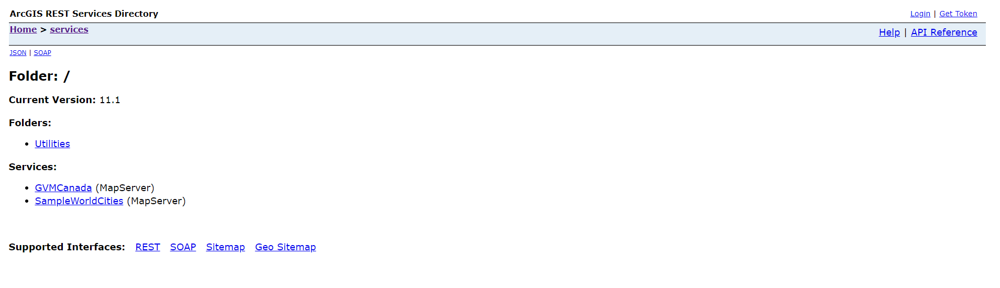

### Start time 11:30PM 

### Stop Time 01:30AM 

### Date 14, March,2024 

When using the Remote Desktop Connection if :444 is missed at the end of the IP adress for the computer following error will occur. 

***To resolve this error make sure computer>IP:444*** 

 

This error occurs when the VM is not ready yet.

When the wrong port is added while starting the Remote Desktop Connection following error is occurred. 

### Publishing map from the server 

While signed into the remote desktop, Copy the Canada zip file from the desktop and create the arcgisworkspace folder in the c drive of your local PC. 

Add the zip file here and extract the file here (make same path as in the remote desktop) 

Then start ArcGIS Pro in your local PC and add the canada shape file from the canada folder previously created. 

Thenchange the symbology or make other changes if you want then  

Connection Add New ArcGIS Server connection. 

Go to Catlog and server 

Here for the connection use your server pathway 

https://CurrentExternalIP:6443/arcgis 

Usesrname and password provided on D2L 

OK 

Then go to catalog>Servers>Your server 

Right click and choose publish option>Map Service

Make sure to Analyze not Publish] 

Following error will occur 

Solve First two errors  

00374 error by right click>second option 

24011 This error should be solved carefully 

Right click and choose first option>Register Folder>Choose file of Canada file which should be same in local PC and Remote Desktop 

Analyze again and the remaining warnings can be ignored  

Publish 

After Publishing check in your server. This file should be uploaded while being referenced rather than copied

